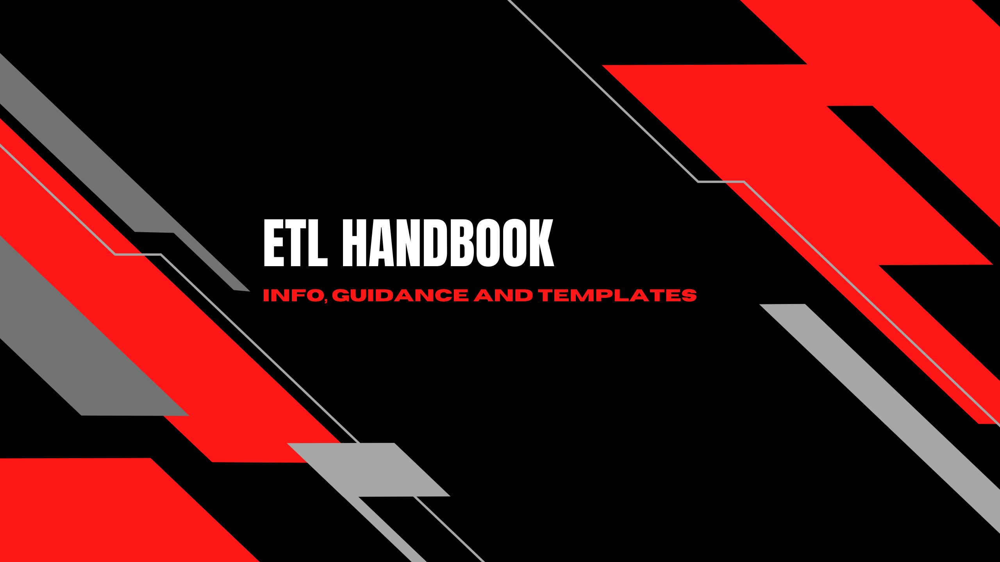

<h3 align="center"> 
  
</h3>

<h1 align="center">
   <a href="#"> ETL HANDBOOK </a>
</h1>

<h3 align="center">
    ETL Work Model
</h3>

  
  
  
  
  
  </a>

<h4 align="center"> 
	 Status: Ongoing
</h4>

---

## Team
### Contributors
<table>
  <tr>
    <td align="center"><a href="https://github.com/vitoriape"> <b>Vitória Peçanha</b></a> <a href="https://www.linkedin.com/in/vitoria-pecanha/" title="LinkedIn">🌐</a>   <a href="mailto:vitoriapecanha.log@gmail.com" title="E-mail">📬</a>   <a href="https://www.workana.com/pt/freelancer/adc45c752416bdaecd6e912140fe5fd3" title="Workana Profile">📊</a></td>
  </tr>
</table>
